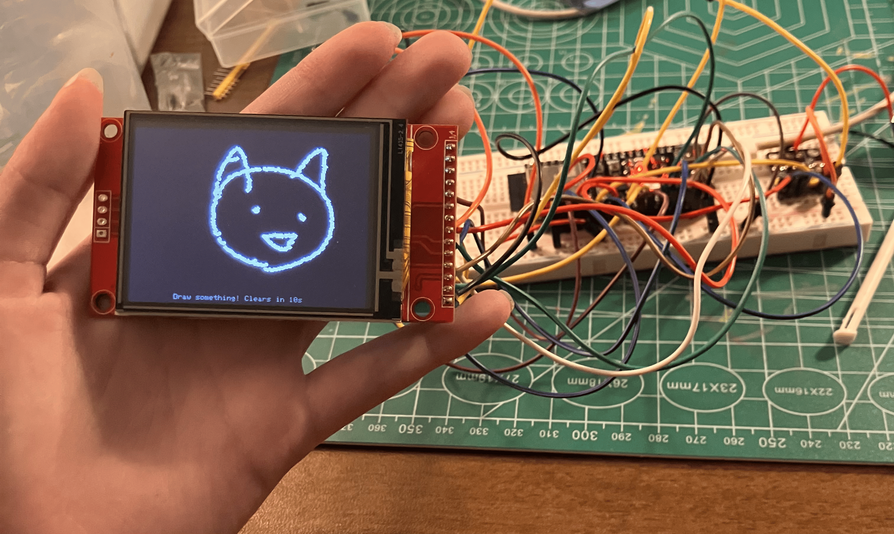
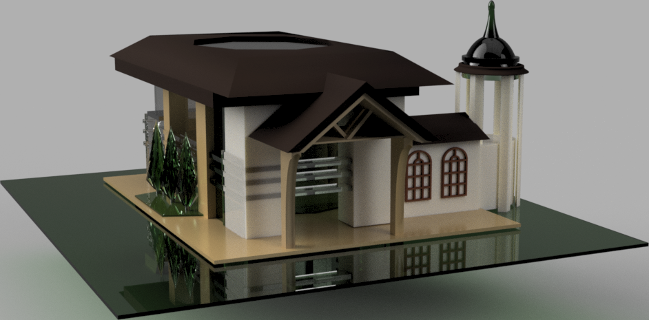
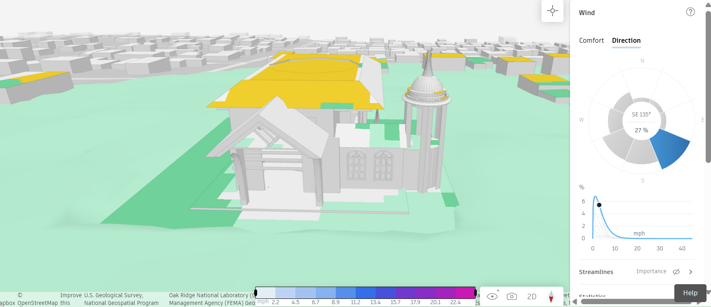
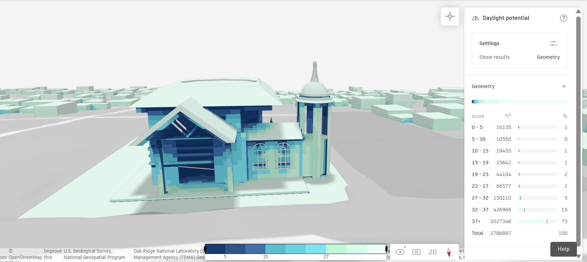
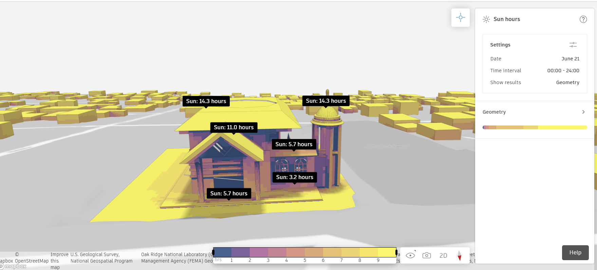

# Nancy Wang
Mechanical Engineering student at UC Berkeley, manufacturing design, mechatronics, and
product development. I like taking a design from CAD through analysis to something that
could actually be built.
[Email: Mwang3@berkeley.edu](Mwang3@berkeley.edu)· [GitHub](https://github.com/wang-nancy)

## 5-Jaw Radial Gripper — CAD + FEA

A radial gripper with central pushrod (slider-crank) actuation, taken from CAD through a
static structural FEA in Ansys. I derived the grip-force load case from first principles,
used a two-step loading strategy to separate mechanism closing from grip loading, and read
the results and distinguishing rigid-body closing motion from actual
elastic deflection.

Peak von Mises stress and total deformation from the static two-step run:

[View the full project and FEA writeup →](https://github.com/wang-nancy/Gripper-robot)

---

## Four-Legged Robot — CAD

A quadruped walking robot designed in SolidWorks, with fully articulated legs built as
repeated linkages. The repo includes an interactive 3D model you can rotate in the browser.

[View the project + spin the 3D model →](https://github.com/wang-nancy/4-leg-bot)

## Tamagotchi from scratch- Ongoing 

### Components used
  ESP32-S3 (main microcontroller) transitioned to Raspberry Pi Zero 2 W for future improvability
  MicroSD card
  Battery 
  joystic 
  DRV2605L Haptic Module 
  ERM vibration motor
  Arducam IMX219 8 MP Camera V2
  15-pin ribbon cable
  Speaker
## Other 
Architectural competition "Autodesk Design & Make It Real: Make It Heal", first place
documentation: https://www.instructables.com/Building-for-Its-People-Makerspace-for-Altadenas-P

Forma Analysis of wind, daylight potential, and sunhour

tamagotchi version 1 and documentation
https://www.instructables.com/Mini-Tamagunio-Updated-Assembly-Guide-With-Trouble
## Skills

- **CAD:** SolidWorks — parts, assemblies, mechanisms
- **Analysis:** Ansys Mechanical — static structural FEA, contact/joint modeling
- **Focus areas:** mechatronics, manufacturing / NPI design, materials

## About

<!-- A few sentences: what you're focused on at Berkeley, the kind of internship you're
looking for (e.g. manufacturing design / NPI), and what makes your angle distinctive. -->
