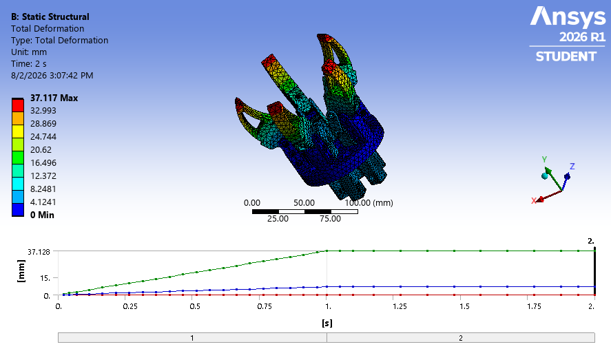
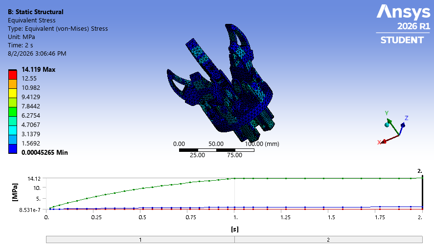
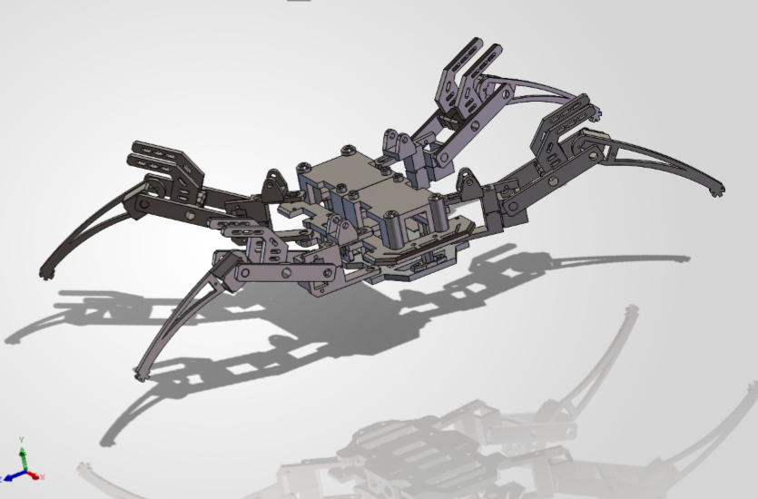
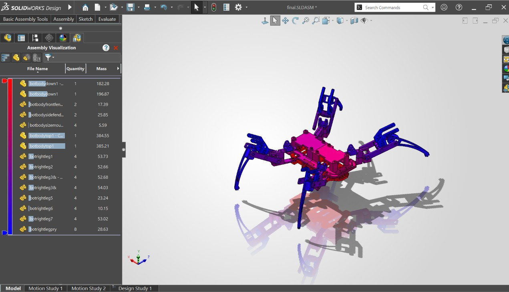
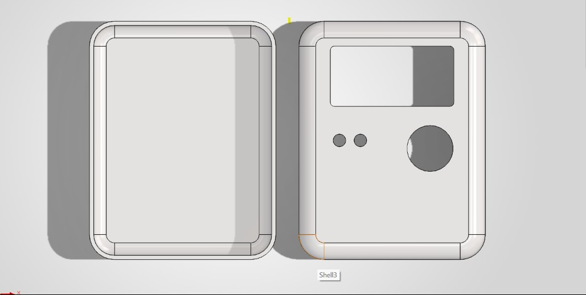

# Nancy Wang

Mechanical Engineering student at UC Berkeley — manufacturing design, mechatronics, and
product development. I like taking a design from CAD through analysis to something that
could actually be built.

<!-- Add your links — delete any you don't want:
[Email](mailto:you@example.com) · [LinkedIn](https://www.linkedin.com/in/your-handle) · [GitHub](https://github.com/wang-nancy)
-->

---

## 5-Jaw Radial Gripper — CAD + FEA

A radial gripper with central pushrod (slider-crank) actuation, taken from CAD through a
static structural FEA in Ansys. I derived the grip-force load case from first principles,
used a two-step loading strategy to separate mechanism closing from grip loading, and read
the results carefully — including distinguishing rigid-body closing motion from actual
elastic deflection.

Peak von Mises stress and total deformation from the static two-step run:

[View the full project and FEA writeup →](https://github.com/wang-nancy/Gripper-robot)

---

## Four-Legged Robot — CAD

A quadruped walking robot designed in SolidWorks, with fully articulated legs built as
repeated linkages. The repo includes an interactive 3D model you can rotate in the browser.

[View the project + spin the 3D model →](https://github.com/wang-nancy/4-leg-bot)

## Tamagotchi- ongoing 

!(touchscreentest.gif)
!(screentest.png)

## Skills

- **CAD:** SolidWorks — parts, assemblies, mechanisms
- **Analysis:** Ansys Mechanical — static structural FEA, contact/joint modeling
- **Focus areas:** mechatronics, manufacturing / NPI design, materials

---

## About

<!-- A few sentences: what you're focused on at Berkeley, the kind of internship you're
looking for (e.g. manufacturing design / NPI), and what makes your angle distinctive. -->
